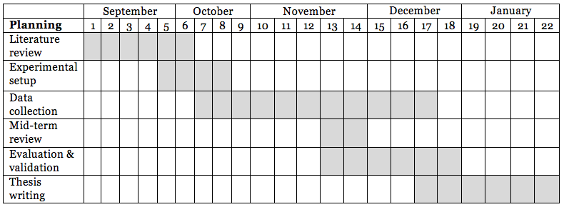

Timeline
--------


LogBook
-------
- [August](https://github.com/gtrdp/masters-thesis-guntur/blob/master/LogBook/00-august.md)
- [September](https://github.com/gtrdp/masters-thesis-guntur/blob/master/LogBook/01-september.md)
- [October](https://github.com/gtrdp/masters-thesis-guntur/blob/master/LogBook/02-october.md)
- [November](https://github.com/gtrdp/masters-thesis-guntur/blob/master/LogBook/03-november.md)
- [December](https://github.com/gtrdp/masters-thesis-guntur/blob/master/LogBook/04-december.md)
- [January](https://github.com/gtrdp/masters-thesis-guntur/blob/master/LogBook/05-january.md)
- [February](https://github.com/gtrdp/masters-thesis-guntur/blob/master/LogBook/06-february.md)

October #1
----------
- **Mon Oct  3 11:00:43 CEST 2016**
	- Try to analyze the data: doing preprocessing.
		- Installing `SciPy`: http://www.lowindata.com/2013/installing-scientific-python-on-mac-os-x/
		- use `pip install --user` to install the packages as current user.
		- Good site to test regex: https://regex101.com/
	- Tried to run the VAD on matlab, but got a problem on `sp2max` as it must be compiled from `c` source code.

- **Tue Oct  4 10:28:45 CEST 2016**
	- Fix the experimental setup according to doable scenario.
	- **Possible research** Probably change the scanning period to 5 minutes.
	- Continue working on data processing.
		- Finally got the working code.

- **Wed Oct  5 10:00:37 CEST 2016**
	- Call Niels:
		- Turns out that multiple APs are using the same `eduroam` as their SSID, however, they have different MAC addresses.
		- Is it possible for android to distinguish between APs with same SSID?
			- Possible, using `getBSSID()` method: https://developer.android.com/reference/android/net/wifi/WifiInfo.html#getBSSID%28%29
		- **Possible discussion** does weather affect wifi connection?
		- experiment with randomization period, as mentioned in the paper. This is important to get the optimal scanning period of WiFi.
		- Define the appropriate scanning time and place.
	- Look for a WiFi dongle that support monitor mode.
		- Built in RasPi 3 WiFi does not support monitor mode: https://www.reddit.com/r/raspberry_pi/comments/4ah4oi/psa_the_raspberry_pi_3s_embedded_wifi_card_does/
		- `RTL8188EU` does not work on monitoring mode: http://raspberrypi.stackexchange.com/questions/8578/enable-monitor-mode-in-rtl8188cus-realtek-wifi-usb-dongle
		- **ordered** This might be an option, although it has the same chipset with tenda micro: http://www.ebay.com/itm/150M-USB-WiFi-Wireless-Adapter-LAN-w-Antenna-Raspberry-Pi-2-B-ralink-rt5370Chip-/261561868698?hash=item3ce64d619a:g:hTMAAOxyP4dTdiDR
	- **Learn** how to get the data from the VAD. As it draws an image, it should give a clear data.
	- Learning and Getting the `crowdpp` code to work.
		- Highlight: line `391` the `AsyncTask` for crowd counting.
		- Highlight: line `252` when the event of recording start.
		- What to get: feature extraction using MFCC and YIN; counting people using the unsupervised algorithm.
	- **Important** IEEE public list of OUI: https://regauth.standards.ieee.org/standards-ra-web/pub/view.html#registries
	- **Important** It is not possible to infer the device type from mac address, but only the manufacturer:
		- https://www.experts-exchange.com/questions/23644286/How-to-determine-if-possible-the-device-type-by-MAC-address.html#answer22221053

- **Thu Oct  6 11:03:23 CEST 2016**
	- Working on Crowd++.
		- Using the code from the original version.
		- Remove unrelated code block, such as the relation with smartphone things: battery, calibration (because we do not use semisupervised learning based on the owner voice) etc.
		- The code also uses Java Speech Toolkit (JSTK) from Speech Group at Informatik 5, Univ. Erlangen-Nuremberg, GERMANY.
			- https://github.com/sikoried/jstk
		- Most time spent on debugging the code.
		- Crowdpp also uses YIN pitch tracking algorithm: http://recherche.ircam.fr/equipes/pcm/cheveign/ps/2002_JASA_YIN_proof.pdf
		- Finally got the code to work, bug found in file format and feature extraction (delete the feature after completed, otherwise the next process will append it which will cause Exception)
		- Result on IKEA (the audio must be converted to wav first), which may be wrong (no ground truth available):
			```
			SpeakerCountTask: Finish YIN
			MFCC: audio/ikea.wav.mfcc.bin audio/ikea.wav.jstk.mfcc.txt
			SpeakerCountTask: Finish MFCC
			Speaker count: 2376
			```
		- Result on Grotemarkt:
			```
			SpeakerCountTask: Finish YIN
			MFCC: audio/grotemarkt.wav.mfcc.bin audio/grotemarkt.wav.jstk.mfcc.txt
			SpeakerCountTask: Finish MFCC
			Speaker count: 1702
			```

	- **Argument**: picture based ground truth has a problem in very dymanic places, e.g., grotemarkt.
	- Found SoX, an audio recorder (and even more) for sound recording: http://sox.sourceforge.net/sox.html
		- To record an 5 minutes wav (32 bit PCM) audio (better to down sample the quality, e.g., 16 bit PCM):
		```
		sox -d coba.wav trim 0 05:00
		```
	- **For Presentation** Explain that scanning AP and probe request is impossible to be carried out simultaneously, due to the different WiFi mode.

- **Fri Oct  7 10:02:12 CEST 2016**
	- [x] Revising thesis.
	- [x] Fixing the code for saturday experiment.
	- [x] Looking for bluetooth in terminal: it seems impossible as no solution found.
		- Better to do that in phone, and log the result.
		- using swift: http://stackoverflow.com/questions/24321126/get-bluetooth-devices-in-range-with-swift
		- could not find a reliable solution for mac os.
	- [x] Helping to fix the SME problem.
	- Look for how to build matlab code to be executable.
	- For a very dense crowd, look for an event.
	- **Research** possible problem: moving people, because it is simply hard to track.
		- **Focus** Possibly one place at different time, say grote markt, IKEA, campus.
			- Padeppoel: http://www.inwinkelcentra.nl/winkelcentrum-paddepoel/
			- Grote markt: https://gemeente.groningen.nl/sites/default/files/16-evenementenprofiel-grote-markt-br-a4-cw-maart.pdf
			- Grote markt: https://www.rug.nl/staff/p.h.pellenbarg/voordrachten/19._groningen_en_de_grote_markt_haalbaarheid_en_kwaliteit.pdf
			- Vismarkt: https://gemeente.groningen.nl/sites/default/files/16-evenementenprofiel-vismarkt-br-a4-rh-0104.pdf
			- IKEA (see page 7 and 9) http://www.ruimtelijkeplannen.nl/documents/NL.IMRO.0848.BP701ekkersrijt-OH01/tb_NL.IMRO.0848.BP701ekkersrijt-OH01_02.pdf
			- P.S. the above documents have also been saved locally for backup if the link broke.
	- Trying other VAD libraries.
		- https://pypi.python.org/pypi/webrtcvad
		- The `crowdpp` does not seem to be really accurate.

- **Sat Oct  8 12:04:35 CEST 2016**
	- Experiment for both social density and mac address randomization.
	- **Possible experimental setup**
		- set a table of experiment. do the same place for several consecutive days.
		- mark the only 1 probe request as passing by people.
	- **Tips**:
		- If you feel so tired, relax, take a deep sleep and tomorrow morning you'll get better and more energetic.
		- Read news, which is good to open up conversation with supervisors.
	- Interesting for randomization: http://www.slideshare.net/airtight/ios8-mac-randomization-via-airtight-blog-series
	- Learning about MAC address randomization.

- **Sun**
	- Deadline Chapter 2.
	- [ ] create preprocessing script ready for production.
		- [x] incorporate speech count: using crowdpp
		- [x] make it runnable.
		- [x] create how to if it does not have sufficient input arguments.
		- [x] ready to set the cut off (threshold)
		- [x] fix the legend location.
		- [x] apply MAC address OUI removal and show the graph.
		- [ ] create text data dump for scatter plot.
		- [ ] create vendor comparison from dump file.
	- [x] Fixing sensing app.
		- [x] Add number of loop, so that the script will stop when it reaches this number.
		- [x] Add sleep time.

October #2
----------
- **Mon Oct 10 11:52:51 CEST 2016**
	- Prepare the presentation for friday.
		- How to count correlation: Pearson r.
			- And explain about what it does.
			- Possibly look for other methods of getting correlation. 
		- Do the experiment twice, with different scanning period.
		- Explaing the scanning mechanism, what we do in each scanning period.
		- set a table of experiment. do the same place for several consecutive days.
		- show the correlation scatter graph, as found somewhere near sk-learn.
		- explain the instruments used: tech spech of macbook air.
	- Email Niels.
	- Beware of winter break, as everyone is going to be away for vacation.
		- Preferably to have the thesis done before winter break, as in january Prof Aiello is also gonna be away for sabbatical leave.
	- Studying for Nederlandse toetsen.
	- Answering SME questions.

- **Tue Oct 11 11:01:34 CEST 2016**
	- Working on presentation for Friday.
	- Working on SME.
	- **Possible ideas** For other location, use wiggle.net as the basis of selection.
	- Making the script executable. Creating quite mode for the java code.
	- Working on the `wifisense.sh` and `dataprocessing.py`
	- Looking for the difference between `adhoc` and `infrastructure` wifi.
	- Got the OUI list here: http://linuxnet.ca/ieee/oui/
		- The OUI part is almost done.

- **Wed Oct 12 10:30:13 CEST 2016**
	- Call Niels.
		- Explain about machine learning (with 3 features) approach.
		- Make presentation, that will also be presented on Friday.
		- Does behapp also scan for BLE device? or only classic bluetooth?
		- How big is the required N?
	- **Discussion notes**:
		- Forget about Bluetooth, as it is proven to be unstable. Although bluetooth is on, it is not discoverable.
		- How big is the N? is a magic question, it really depends on the data. The thing is, the data should give a firm insight of understanding.
		- VAD and speaker count are promising, learn how it works.
		- In Crowdpp `theta_s` and `theta_d` are the parameters for detecting speaker count. Play with it.
		- Do the scanning in this patern: 1 minute probe request and AP scanning. That way we might avoid the randomization and we can get more data points.
		- For a short experiment, compare the result of 1 minute, 5 and 10 minutes, and see whether there is a linear correlation (increase).
		- Test and recheck what Freudiger has done about MAC address randomization.
		- When android is in energy saving mode, the OS prohibits any app for doing WiFi Scan or any other scan.
		- See how often randomization occurs, and how often phone sends out probe request.
	- Bluetooth has 10 meters of range: http://www.sans.edu/research/security-laboratory/article/bluetooth
	- BLE scanner in Mac: https://github.com/samuraipapa/BLE-Mac-Scanner
	- Do MAC address randomization experiment tonight.
	- Working on preprocessing script.

- **Thu Oct 13 12:57:31 CEST 2016**
	- SME problem solving.
	- Looking for microphone recording in phone.
		- http://electronics.stackexchange.com/questions/59157/over-what-frequency-range-can-the-microphone-of-smartphone-receive-the-sound
		- http://www.makeuseof.com/tag/great-tips-recording-audio-smartphone-tablet/
		- http://www.scienceprog.com/long-range-directional-microphones-myth-and-reality/
		- http://www.epanorama.net/newepa/2014/09/08/sound-level-measuring-with-android-phone/
		- **seems legit** http://www.analog.com/library/analogdialogue/archives/46-05/understanding_microphone_sensitivity.html?doc=an-1328.pdf
	- **Possible research** using dB (decibels) to identify social density.
		- Decibels does not correlate linearly, but rather logaritmically.
	- Working on source code again.
	- Good for python example: http://www.jesshamrick.com/2011/05/18/an-introduction-to-classes-and-inheritance-in-python/
	- For scatter plot
		- http://people.duke.edu/~ccc14/pcfb/numpympl/MatplotlibBarPlots.html
		- http://www.labri.fr/perso/nrougier/teaching/matplotlib/

- **Fri Oct 14 11:17:40 CEST 2016**
	- Meeting with Prof Aiello and Prof Kas.
		- Prepare the schedule for the next meeting.
		- Possible ground truth is official document from stakeholders.
		- How big is the required N? (Magic question?)
		- It is also useless if we use very good microphone, as we will eventually implement that in a simple microphone on smartphone.
		- How if we do not have enough data?
		- Is the method scientifically correct?
	- Listing the lecturers for email.
	- **Possible research**: incorporate time of scanning, e.g., during rush hour, morning, or afternoon.
		- Possibly also add vismarkt as another location for scanning.
		- Also take pictures when doing the experiment.
	- **Meeting notes**:
		- Make sure we have reliable ground truth only for sampling of data. Possible ground truth:
			- Go Pro with facing up camera.
			- panoramic picture
			- camera with 4 different angle.
			- video
		- That way we will have 3 comparisons: PR, AP, VAD, and ground truth.
		- More location for scanning:
			- Add more remote areas, for less people.
			- Add more crowded area, e.g., train station.
			- Also take home, e.g, an hour during breakfast.
		- **next experimental setup** do that while moving, e.g., with train, bike, or bus.
		- **Writing ideas** scope down your thesis (for the limitation or aim of research), describe and elaborate what your setting is: fixed situation of scanning, etc.
		- Possible next or other experimental setup: record the interaction of a person within 24 hours.

- **Sat Oct 15 20:24:46 CEST 2016**
	- **Ideas**: incorporate decibels: both the number or quantized (by using mean, median, min or max values).

- **Sun Oct 16 16:50:29 CEST 2016**
	- Working at CMB.
	- Additional places:
		- Home (breakfast)
		- Remote areas (min 2): use wiggle.net as the basis.
	- Learn about carding.
	- **research notes**: we are only interested in seeing the correlation between probe request and access point count. Try to stick with that.

October #3
----------
While doing data collection, also work with writing the thesis or reading the book.

- **Mon Oct 17 10:32:55 CEST 2016**
	- **Goal of this week**:
		- MAC address randomization: learn how it works, get the timing parameters.
		- Get the probe request count
		- collect data (also from added locations)
		- get db measure
		- get people count
		- capture ground truth using panoramic images
		- extract all graph of locations
		- extract scatter graph
	- Work on the code, make sure the code works.
	- Coordinating for verhuizing.
		- Working on excel and publication.
	- Location for MAC address: forest near zernike complex.
	- To get probe request in wireshark: `wlan.fc.type_subtype==4`
	- **Interesting finding**: nexus 5x immediately sends out probe request when wake up from sleep.

- **Tue Oct 18 10:34:12 CEST 2016**
	- Work on MAC address randomization.
		- Explain what you did in detail, the phone type, restarting the phone at first, etc.
		- Investigate the MAC address after experiment.
	- When doing probe request explain the phone condition:
		- What the phone is: LG Nexus 5X, Android N
		- Battery level
		- Phone has been restarted.
		- charged/discharged
		- phone is in sleep mode or not
		- the phone is awake
		- Location of scanning.
	- What to investigate:
		- The SN (sqeuence number)
		- when randomized mac address appear.
	- **Research**: find literature about sequence number. find official ieee 802.11 standard.
	- **Experiment result**:
		- The phone immediately sends out probe request with original mac when it wakes up from sleep. Usually 4 or 10. If the phone has woken up from a long sleep, more than 1 minutes. When the screen is locked.
		- The phone keeps sending out using the same first 3 byte of address. Brutally changes the last 3 octets.
		- The `SN` is close, but not really sequential.
		- iPad: also keeps sending out probe request when the display is on.
		- Take note the changes of mac address of LG Nexus 5X.
		- Every 10 secs (roughly) sends out 2 probe request, same manufacturer, different last 3 octets. Sequential or close SN.
		- But when it is stable, it sends out every roughly 60 secs, with each different mac (but same ). Count of probe beacon: 1 or 2, or even 3.
		- To prove it, I turned off the phone and there is no such mac address.
		- The mac address `SN` is close, but not sequential.
		- The pattern: original -> 10 sec -> 4 times random -> 60 secs.
		- The SN is restarted when the phone is active (not sleeping).
		- The randomized MAC address: `da:a1:19`. And LG is always using that same mac?
		- For the next experiment, please make sure that your phone WiFi is switched off.
		- When the screen is on, the phone does not send out randomized mac address.
		- Also test it using tcpdump.
		- When the phone restarted, it firstly sends out real mac address.
		- Create flowchart to filter out randomized mac.
		- Every burst of probe request, the address changes.
		- Even when WiFi is off, LG occasinally sends out probe request with original mac.
	- **Experiment result iPad**:
		- The iPad keeps sending out randomized mac even tough the screen is on.
		- Then the loading ion appears, the burst of probe request also captured.
		- Then iPad wakes from sleep, the mac address also changes. But still randomized.
		- When the screen is on, it keeps sending out probe request within 3, to 10 secs.
		- Take notes the randomized mac addess.
		- Take notes the setting of ipad prior and after sim card installation.
		- When I switched off the WiFi and on, the mac address changes. The `SN` is also restarted.
		- No difference, when the sim card is installed or not.
		- When ipad is connected to an AP (ad hoc, from Nexus), it sends out original mac address.
		- But the SN is always restarted. (Chance of solution)
		- If the iPad is in sleep mode, it sends out roughly every 2 minutes (135 secs) or even 4 minutes. and the `SN` is always restarted.
		- The `SN` is always resetted in each burst.
		- The pattern, 2x2 minutes, 4 minutes, then change MAC address
		
	- **Research**: see the penetration or market share of each mobile OS.
	- **Study**:
		- who is responsible for generating randomized mac address.
		- What is locally administered MAC address.
	- IEEE 802.11 standards: http://standards.ieee.org/about/get/802/802.11.html
		- Page 388:
		
		```
		The Sequence Number field is a 12-bit field indicating the sequence number of an MSDU, A-MSDU, or MMPDU. Each MSDU, A-MSDU, or MMPDU transmitted by a STA is assigned a sequence number. Sequence numbers are not assigned to control frames, as the Sequence Control field is not present.		
Each fragment of an MSDU or MMPDU contains a copy of the sequence number assigned to that MSDU or MMPDU. The secondquence number remains constant in all retransmissions of an MSDU, MMPDU, or fragment thereof.
		```
	- Next experiment: capture packet from multiple channel.
	- WiFi channel should not be a problem because probe requests are usually sent to all channels. Do not forget to cite.
	- **For writing**: Monitor mode is one of the seven modes that 802.11 wireless cards can operate in: Master (acting as an access point), Managed (client, also known as station), Ad hoc, Mesh, Repeater, Promiscuous, and Monitor mode. https://en.wikipedia.org/wiki/Monitor_mode
	- Channel hopping is a 'lossy' method. 

- **Wed Oct 19 14:08:48 CEST 2016**
	- Start data collection for probe request.
	- **Research Notes**: when working on pictures, also take note the camera setting: white balance, HDR, focus, etc.
	- Additional places remote places:
		- Park selwerd
		- Noorderplantsoen
		- Oosterpark
	- **Study literature**: find in IEEE standard, in which channel does wifi sends out probe request.
		- Active scanning is described in IEEE document page: 978
	- Work on paper for publication.
- **Thu Oct 20 10:31:51 CEST 2016**
	- Working on the paper.
	- Research gate job profile.
	- Data collection is cancelled (late).
	- Investigating MAC address randomization.
	- **Possible discussion**; Look for each floor map of each scanning location, this might be useful to discuss if the result does not match with the ground truth.
	
- **Fri Oct 21 17:39:08 CEST 2016**
	- Data collection in:
		- IKEA (cancelled due to difficult for collecting ground truth)
		- Pioenpark
		- Grotemarkt
		- Paddepoel
	- Working on scripting code and data analysis.
	- Trying to use go pro for ground truth.
	- **Result**: `airport -s` takes 3 to 4 seconds in average.
	- Try to use pomodoro to work and to get better productivity.
	- **Possible writings**: explain using figure, train moving, that the scanning might be biased as the train moves. also include the scanning duration of airport.
	
- **Sat Oct 22 15:32:17 CEST 2016**
	- Working on the code at UMCG.
		- Refactoring the code to be modular.
	
- **Sun Oct 23 21:38:23 CEST 2016**
	- Randomization.
	- Working on the code.
	- Got the 2 GoPros from Bhimo and Erlang. One is coming tomorrow from Ci Renren.
	- GoPro 180 view: http://www.cultofmac.com/444004/your-gopro-videos-will-do-a-180-with-this-lensbaby-fisheye/
	- GoPro 360 view using 3 devices:
		- https://www.dropbox.com/s/v7s28k4d7nf3ern/gopro3X360.jpg
		- https://www.reddit.com/r/oculus/comments/2brgx2/spherical_4k_360180_videos_with_only_3_gopro/
	- **Writing**: For the time of taking time lapse, use the average biking speed for human.
	- **Possible work**: Filter out also based on probe request RSSI.
	- Azurewave (`DC85DE`) is possibly coming from chromecast.
	- **Writing**: write also what experiment that we have been done.
		- different scanning period, etc.
		- How many times pilot testing were carried out.
	- Devising what are needed for data processing.
	- **Note**: remember to do pilot testing before going to the real experiment.
	- Nice to have gui to process the data.
		- https://kivy.org/#home
		- https://wiki.python.org/moin/TkInter (de facto official)

October #4
----------
- **Mon Oct 24 13:50:00 CEST 2016**
	- **Goal of this week**:
		- Discuss the findings with supervisors.
			- Explain that ground truth checking is kind of reinventing the wheel, as there is already a paper that discusses the relation of probe request and social density.
			- Explain that we are particularly interested with the relation of probe request and access point count.
			- Explain the aim of this research, which will be implemented in BeHapp app.
			- Explain the drawbacks of panoramic picture: cut human, unaligned images.
			- Discussing about the next possible experiment.
			- Getting ground truth is hard, and it is not the real ground truth.
			- Show the map of experiment.
			- Show before and after the signal strength removal.
	- Investigate the relation of WiFi signal strength and distance.
	- Working on the code.
	- **Idea**: to see the correlation between probe request and actual social density, it is better to test it in controlled situation (laboratory).
	
	- **Idea**: filtering out the probe request by rssi? since the probe request may be coming from far away. Should we also implement this to the access point?
	- **Writing**: got the justification of thresholding for probe request from mas azka, about localization and converting from signal strength to distance.
	
- **Tue Oct 25 10:05:18 CEST 2016**
	- Discussion with Niels.
		- Distribution of signal strength, use it to work on threshold.
		- 0.3 of correlation means that 30% of the variation is explained.
		- hashing the probe request, to overcome the randomization.
		- make sure the one minute time interval is reliable to overcome the randomization.
	- Working on randomization.
		- SN might be a good solution for this, just have to test it
		- hashed probe request data (management frame) could be unique for each device.
		- http://www.rfwireless-world.com/Terminology/WLAN-probe-request-and-response-frame.html
	- Working on gopro.
	- **Study**: what is the signal strength in beacon frame.
	- **Experimental setup**: also record when taking breakfast.
	- Signal strength:
		- https://documentation.meraki.com/MR/WiFi_Basics_and_Best_Practices/Wireless_fundamentals%3A_Signal-to-Noise_Ratio_(SNR)__and_wireless_signal_strength
		- https://ccie-or-null.net/2011/01/24/understanding-a-wi-fi-connection/
		- http://www.watchguard.com/help/docs/wsm/xtm_11/en-us/content/en-us/wireless/ap_wireless_signalstrength_c.html
> In general, you should have a minimum of +25dBm signal-to-noise ratio. Lower values than +25dBm result in poor performance and speeds.
	- **Writing**: explain why we do not do that in school/university, because WiFi is highly restricted in campus, i.e., we are not allowed to have individual access point in school.
	- **Writing**:
		- time lapse is selected to conserve energy.
		- energy is one of the concern.